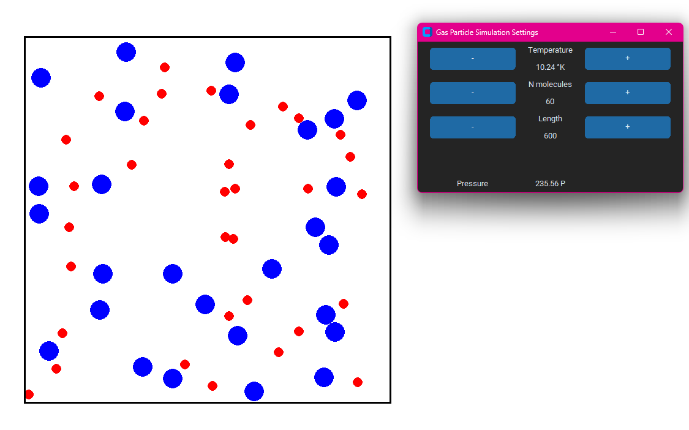

# Gas Particle Simulator
A ideal gas simulator, similar to the one from [The University of Texas at Austin](https://ch301.cm.utexas.edu/simulations/js/idealgaslaw/). Simulates gas molecules and their thermodynamics.

